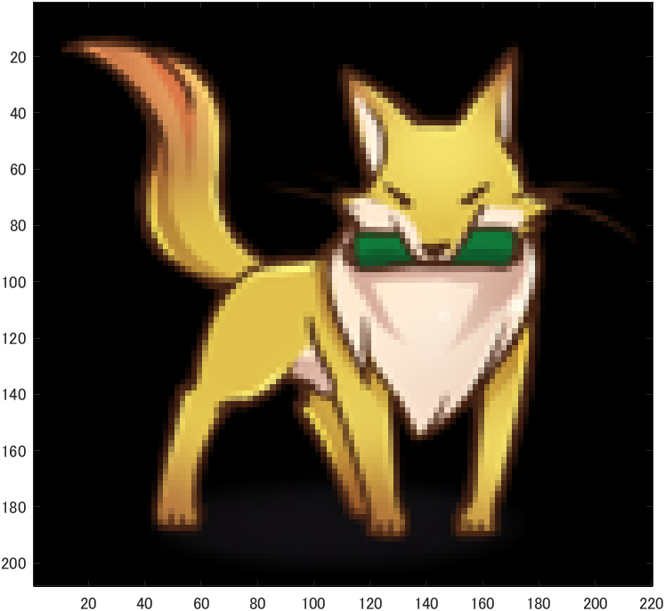
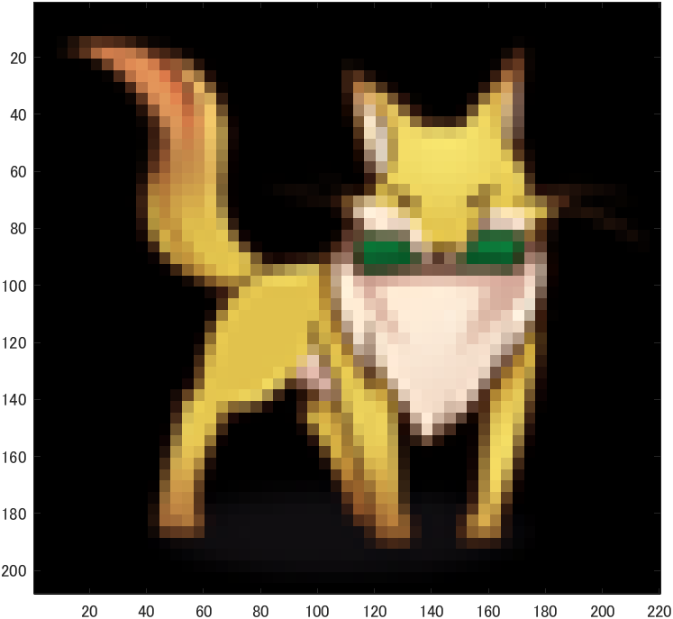
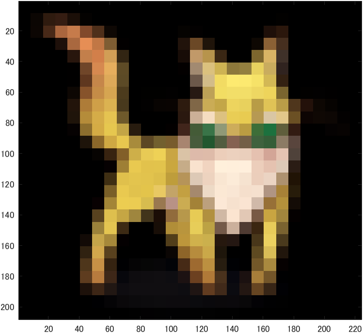
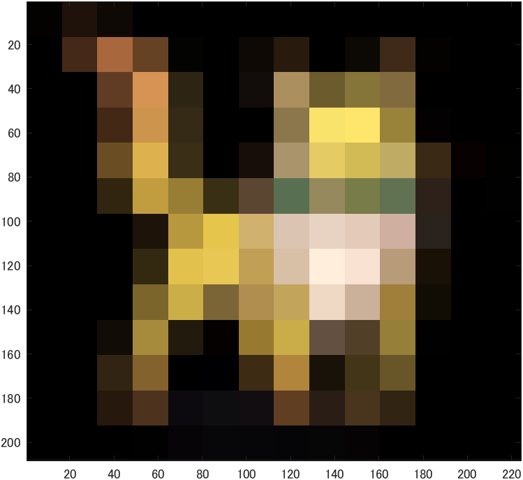
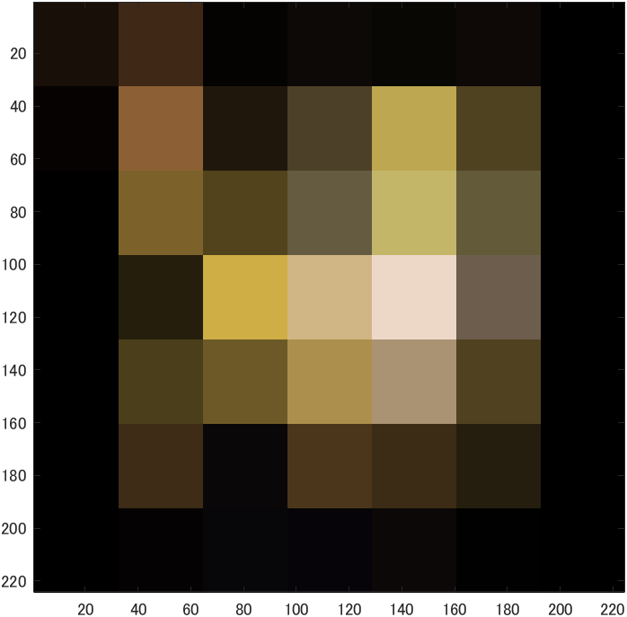

# kadai1 
## 標本化間隔と空間解像度
 - 画像をダウンサンプリングして表示した。 
 - 画像「f_fox.png」を原画像とした。この画像は縦207画素、横220画素である。
 - 原画像を図1に示す。
元画像の入力は以下のコードから行った。
```m
ORG=imread('f_fox.png'); % 原画像の入力
imagesc(ORG); axis image; % 画像の表示
```


<div align="center">
<br>
図1,原画像
</div>

---
## 1回目の縮小
- 以下のコードを実行した。
```m
IMG = imresize(ORG,0.5); % 画像の縮小
IMG2 = imresize(IMG,2,'box'); % 画像の拡大
imagesc(IMG2);
axis image; % 画像の表示
```
 - 1行目より、原画像を50%縮小し、2行目から縮小画像を2倍に引き延ばしてしている。
 - 結果は図2のようになった。

<div align="center">
<br>
図2,1回目の縮小
</div>

## 2回目の縮小
- 以下のコードを実行した。
```m
IMG = imresize(ORG,0.5); % 画像の縮小
IMG2 = imresize(IMG,4,'box'); % 画像の拡大
imagesc(IMG2);
axis image; % 画像の表示
```
 - 1行目より、1度目の縮小画像をさらに50%縮小し、2行目から縮小画像を4倍に引き延ばしてしている。
 - 結果は図3のようになった。

<div align="center">
<br>
図3,2回目の縮小
</div>

## 3回目の縮小
- 以下のコードを実行した。
```m
IMG = imresize(ORG,0.5); % 画像の縮小
IMG2 = imresize(IMG,8,'box'); % 画像の拡大
imagesc(IMG2);
axis image; % 画像の表示
```
 - 1行目より、2度目の縮小画像をさらに50%縮小し、2行目から縮小画像を8倍に引き延ばしてしている。
 - 結果は図4のようになった。

<div align="center">
<br>
図4,3回目の縮小
</div>

## 4回目の縮小
- 以下のコードを実行した。
```m
IMG = imresize(ORG,0.5); % 画像の縮小
IMG2 = imresize(IMG,16,'box'); % 画像の拡大
imagesc(IMG2);
axis image; % 画像の表示
```
 - 1行目より、3度目の縮小画像をさらに50%縮小し、2行目から縮小画像を16倍に引き延ばしてしている。
 - 結果は図5のようになった。

<div align="center">
<br>
図5,4回目の縮小
</div>

## 5回目の縮小
- 以下のコードを実行した。
```m
IMG = imresize(ORG,0.5); % 画像の縮小
IMG2 = imresize(IMG,32,'box'); % 画像の拡大
imagesc(IMG2);
axis image; % 画像の表示
```
 - 1行目より、4度目の縮小画像をさらに50%縮小し、2行目から縮小画像を32倍に引き延ばしてしている。
 - 結果は図6のようになった。

<div align="center">
<br>
図6,5回目の縮小
</div>
