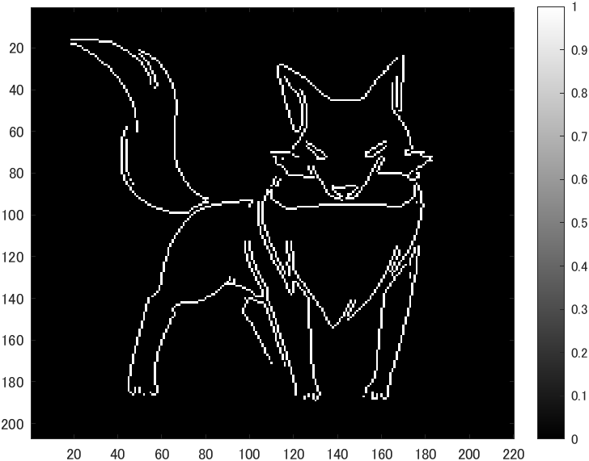
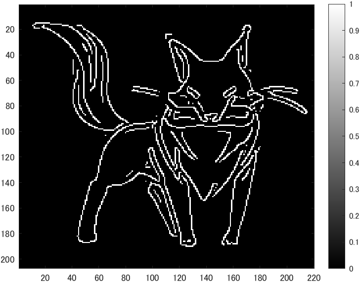

# kadai10 画像のエッジ抽出
- 画像のエッジ抽出を体験せよ
- 原画像を図1に示す。
  
<div align="center">
<br>
図1,原画像
</div>

## プレウィット法
```m
IMG = edge(ORG,'prewitt'); % エッジ抽出（プレウィット法）
imagesc(IMG); colormap('gray'); colorbar;% 画像表示
pause; % 一時停止
```
‐ プレウィット法でエッジ抽出した画像を図2に示す。
<div align="center">
<br>
図2,プレウィット法
</div>

## ソベル法
```m
IMG = edge(ORG,'sobel'); % エッジ抽出（ソベル法）
imagesc(IMG); colormap('gray'); colorbar;% 画像表示
pause; % 一時停止
```
‐ ソベル法でエッジ抽出した画像を図3に示す。
<div align="center">
<br>
図3,ソベル法
</div>

## キャニー法
```m
IMG = edge(ORG,'canny'); % エッジ抽出（キャニー法）
imagesc(IMG); colormap('gray'); colorbar;% 画像表示
pause; % 一時停止
```
‐ キャニー法でエッジ抽出した画像を図4に示す。
<div align="center">
<br>
図4,キャニー法
</div>