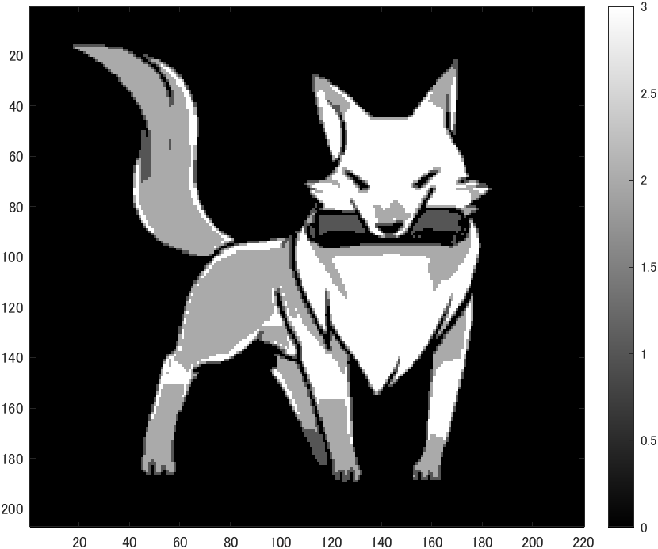

# kadai2 階調数と疑似輪郭
- ２階調，４階調，８階調の画像を生成せよ。
- 原画像を図1に示す。
  
<div align="center">
<br>
図1,原画像
</div>

 - 画像の読み込みは以下のコードを実行した。
```m
ORG=imread('f_fox.png'); % 原画像の入力
ORG = rgb2gray(ORG); colormap(gray); colorbar;
```
 - 2行目より、RGB画像をグレースケールに変換している。
 - 変換は8bitの数値配列に変換している。

## 2階調画像
- 以下のコードを実行した。
```m
IMG = ORG>128;
imagesc(IMG); colormap(gray); colorbar;  axis image;
```
 - 1行目より、グレースケールの1画素の数値が128より大きい部分が白となり、小さい部分が黒となる。
 - 結果は図2のようになった。
  
<div align="center">
<br>
図2,2値化画像
</div>

## 4階調画像
- 以下のコードを実行した。
```m
IMG0 = ORG>64;
IMG1 = ORG>128;
IMG2 = ORG>192;
IMG = IMG0 + IMG1 + IMG2;
imagesc(IMG); colormap(gray); colorbar;  axis image;
```
 - グレースケールの1画素の数値が64,128,192より大きい部分が1となり、それぞれで2値化したものを足し合わせ、0-3の4階調画像にしている。
 - 結果は図3のようになった。
  
<div align="center">
<br>
図3,4値化画像
</div>

## 8階調画像
- 以下のコードを実行した。
```m
IMG0=ORG>32;
IMG1=ORG>64;
IMG2=ORG>96;
IMG3=ORG>128;
IMG4=ORG>160;
IMG5=ORG>192;
IMG6=ORG>224;
%IMG7=ORG>256;  256より大きくはならない

IMG=IMG0+IMG1+IMG2+IMG3+IMG4+IMG5+IMG6;
imagesc(IMG); colormap(gray); colorbar;  axis image;
```
 - グレースケールの1画素の数値が32,64,96,128,160,192,224より大きい部分が1となり、それぞれで2値化したものを足し合わせ、0-7の8階調画像にしている。
 - 結果は図4のようになった。
  
<div align="center">
<br>
図4,8値化画像
</div>