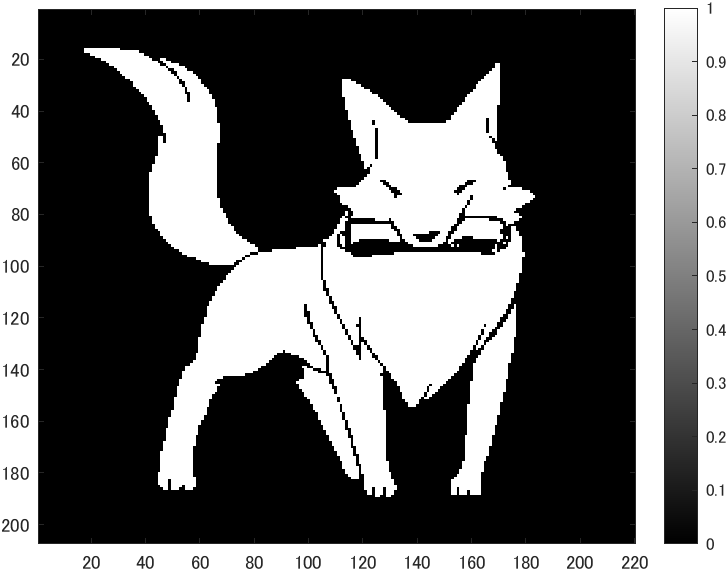
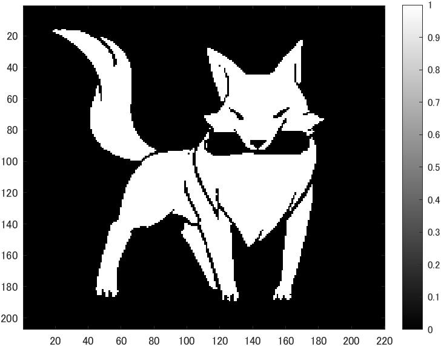
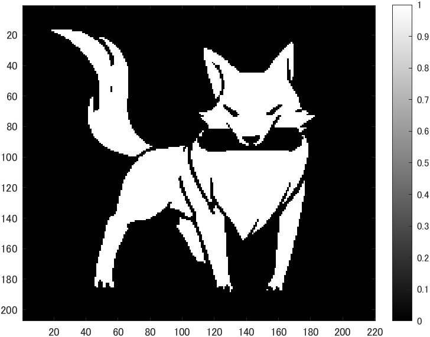
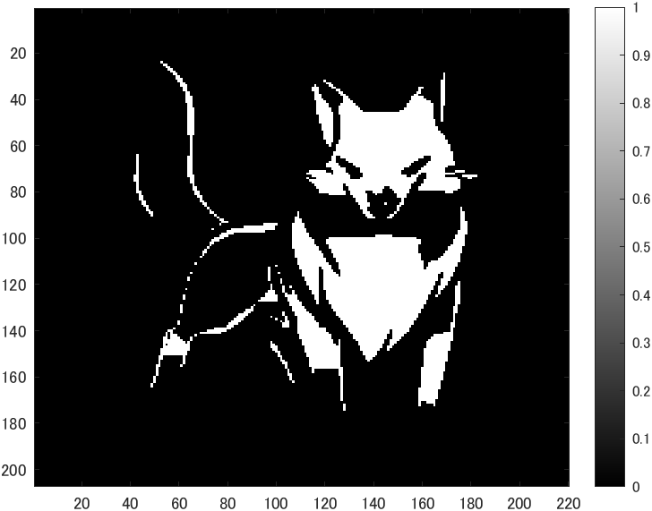

# kadai3 閾値処理
- 閾値を4パターン設定し,閾値処理した画像を示せ．
- 原画像を図1に示す。
  
<div align="center">
<br>
図1,原画像
</div>

## パターン1:輝度値が64以上
-画像の読み込みは以下のコードを実行した。
```ｍ
IMG = ORG > 64; % 輝度値が64以上の画素を1，その他を0に変換
imagesc(IMG); colormap(gray); colorbar;
```
- 結果は図2のようになった。

<div align="center">
<br>
図2,輝度値が64以上
</div>

## パターン2:輝度値が96以上
-画像の読み込みは以下のコードを実行した。
```ｍ
IMG = ORG > 96; % 輝度値が96以上の画素を1，その他を0に変換
imagesc(IMG); colormap(gray); colorbar;
```
- 結果は図3のようになった。

<div align="center">
<br>
図2,輝度値が96以上
</div>

## パターン3:輝度値が128以上
-画像の読み込みは以下のコードを実行した。
```ｍ
IMG = ORG > 128; % 輝度値が128以上の画素を1，その他を0に変換
imagesc(IMG); colormap(gray); colorbar;
```
- 結果は図3のようになった。

<div align="center">
<br>
図3,輝度値が128以上
</div>

## パターン4:輝度値が196以上
-画像の読み込みは以下のコードを実行した。
```ｍ
IMG = ORG > 196; % 輝度値が196以上の画素を1，その他を0に変換
imagesc(IMG); colormap(gray); colorbar;
```
- 結果は図4のようになった。

<div align="center">
<br>
図3,輝度値が196以上
</div>