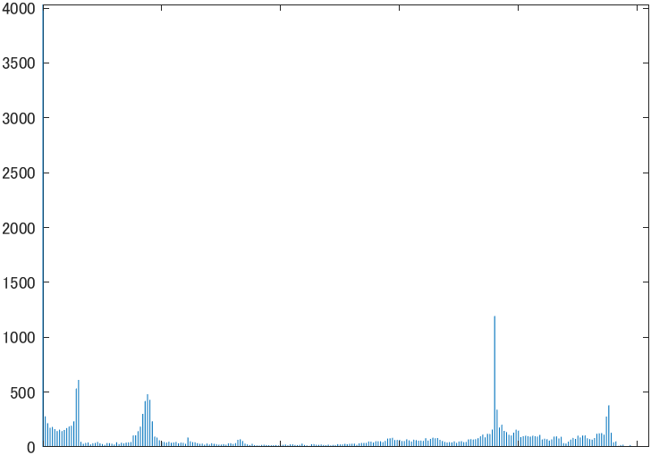

# kadai4画像のヒストグラム
- 画素の濃度ヒストグラムを生成せよ．
- 原画像を図1に示す。
  
<div align="center">
<br>
図1,原画像
</div>

## ヒストグラム生成
 - 以下のコードを実行した。
```m
ORG=imread('f_fox.png'); % 原画像の入力
ORG=rgb2gray(ORG); % カラー画像を白黒濃淡画像へ変換
imagesc(ORG); colormap(gray); colorbar;
pause;

imhist(ORG); % ヒストグラムの表示
```

実行結果を図2に示す。

<div align="center">
<br>
図2,原画像のモノクロヒストグラム
</div>
