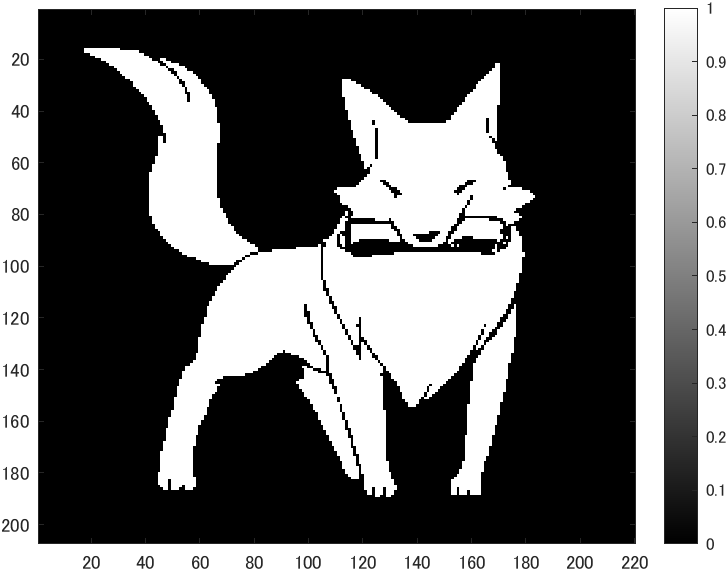
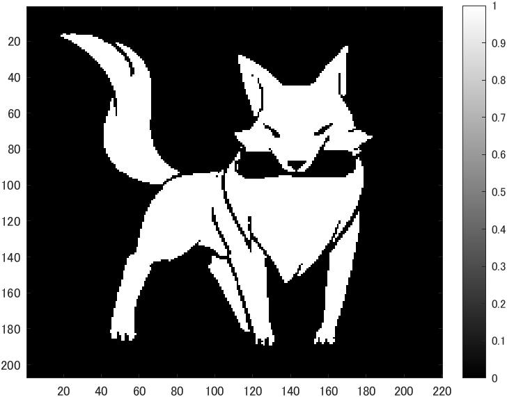
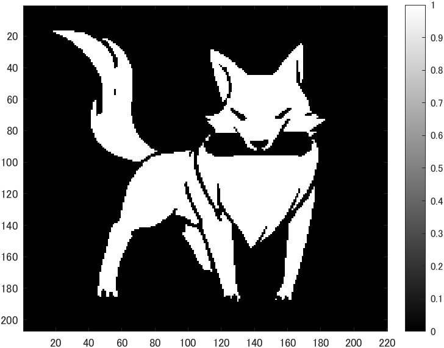
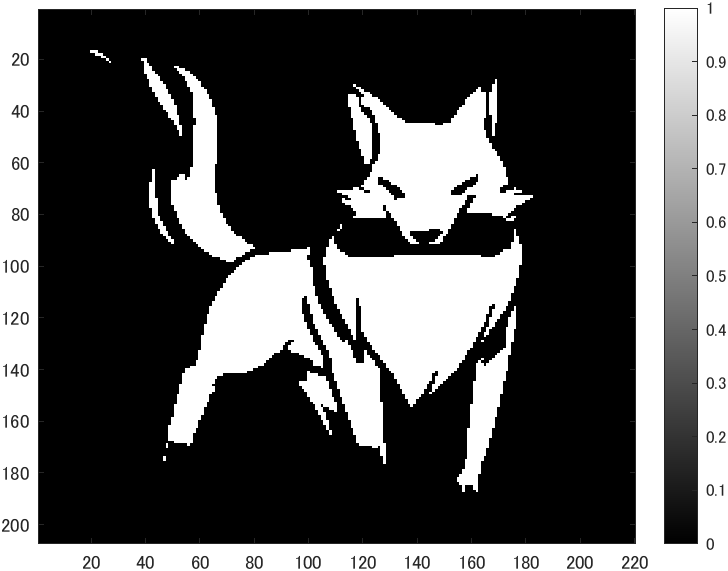
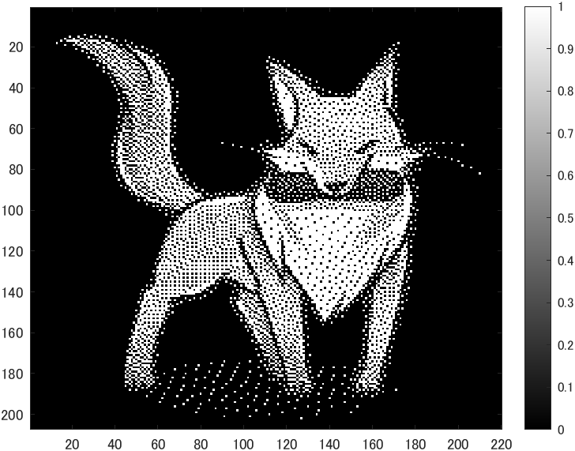

# kadai6 画像の二値化
- 画像二値化せよ．
- 原画像を図1に示す。
  
<div align="center">
<br>
図1,原画像
</div>

```m
ORG=imread('f_fox.png'); % 原画像の入力
ORG = rgb2gray(ORG);
imagesc(ORG); colormap(gray); colorbar; % 画像の表示
pause; % 一時停止
```

## 輝度値64による二値化
 - 以下のコードを実行した。
```m
IMG = ORG>64; % 輝度値64による二値化
imagesc(IMG); colormap(gray); colorbar; % 画像の表示
pause;
```

実行結果を図2に示す。

<div align="center">
<br>
図2,原画像の輝度値64による画像二値化
</div>


## 輝度値96による二値化
 - 以下のコードを実行した。
```m
IMG = ORG>96; % 輝度値96による二値化
imagesc(IMG); colormap(gray); colorbar; % 画像の表示
pause;
```

実行結果を図3に示す。

<div align="center">
<br>
図3,原画像の輝度値96による画像二値化
</div>

## 輝度値128による二値化
 - 以下のコードを実行した。
```m
IMG = ORG>128; % 輝度値128による二値化
imagesc(IMG); colormap(gray); colorbar; % 画像の表示
pause;
```

実行結果を図4に示す。

<div align="center">
<br>
図4,原画像の輝度値128による画像二値化
</div>

## 輝度値160による二値化
 - 以下のコードを実行した。
```m
IMG = ORG>160; % 輝度値160による二値化
imagesc(IMG); colormap(gray); colorbar; % 画像の表示
pause;
```

実行結果を図5に示す。

<div align="center">
<br>
図5,原画像の輝度値160による画像二値化
</div>

## ディザ法による二値化
 - 以下のコードを実行した。
```m
IMG = dither(ORG); % ディザ法による二値化
imagesc(IMG); colormap(gray); colorbar; % 画像の表示

```

実行結果を図6に示す。

<div align="center">
<br>
図6,原画像のディザ法による画像二値化
</div>
