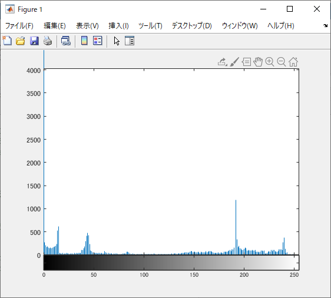

# kadai7 ダイナミックレンジの拡大
- 画素のダイナミックレンジを０から２５５にせよ
- 原画像を図1に示す。
  
<div align="center">
<br>
図1,原画像
</div>

```m
ORG=imread('f_fox.png'); % 原画像の入力
ORG = rgb2gray(ORG);
imagesc(ORG); colormap(gray); colorbar; % 画像の表示
pause; % 一時停止
```

## ダイナミックレンジの拡大
```m
imhist(ORG); % 濃度ヒストグラムを生成、表示
pause;
ORG = double(ORG);
mn = min(ORG(:)); % 濃度値の最小値を算出
mx = max(ORG(:)); % 濃度値の最大値を算出
ORG = (ORG-mn)/(mx-mn)*255;
imagesc(ORG); colormap(gray); colorbar; % 画像の表示
pause;
ORG = uint8(ORG); % この行について考察せよ
imhist(ORG); % 濃度ヒストグラムを生成、表示
```

- ``uint8(ORG)``ここで、濃度値を符号なし8ビットに変換している。0-255となるので、ダイナミックレンジの変換に成功しているといえる。

<div align="center">
<br>
図2,ダイナミックレンジの拡大
</div>

