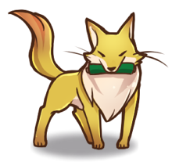

# kadai8 画像の連結成分
- 二値化された画像の連結成分にラベルをつけよ
- 原画像を図1に示す。
  
<div align="center">
<br>
図1,原画像
</div>

## 輝度値128による二値化
```m
IMG = ORG > 128; % 閾値128で二値化
imagesc(IMG); colormap(gray); colorbar; % 画像の表示
pause;
```
- 輝度値128で2値化した画像を図2に示す。

<div align="center">
<br>
図2,輝度値128で2値化した画像
</div>

## ラベルつけ
```m
IMG = bwlabeln(IMG);
imagesc(IMG); colormap(jet); colorbar; % ラベル付き画像の表示
pause;
```
 - 画像にラベルを付けた。
 - 画像を図3に示す。
<div align="center">
<br>
図3,2値化画像にラベル追加
</div>