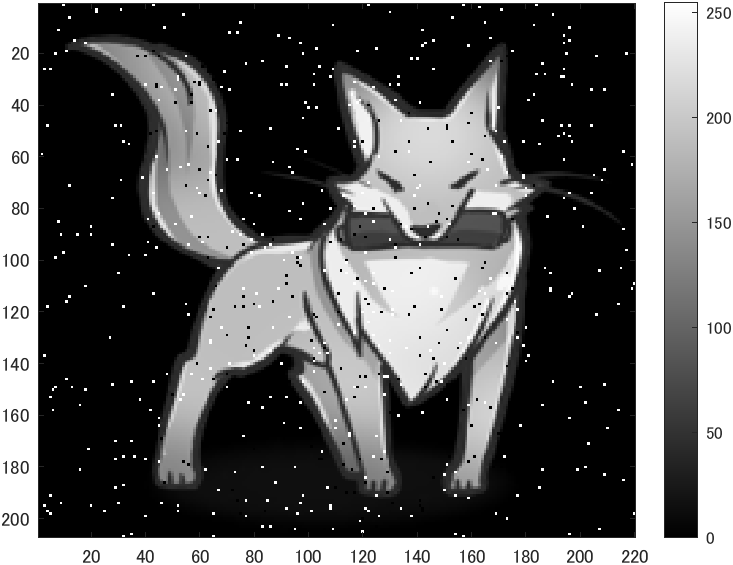
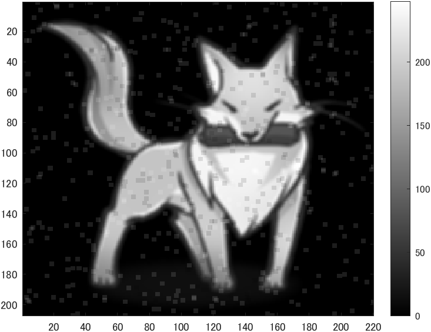
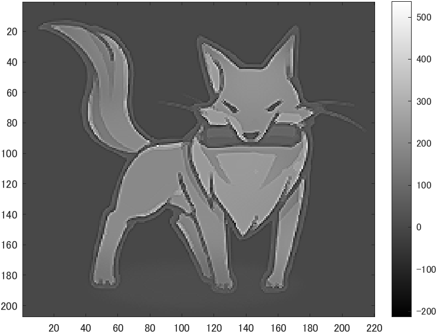

# kadai9 メディアンフィルタと先鋭化
- メディアンフィルターを適用し，ノイズ除去を体験せよ
- 原画像を図1に示す。
  
<div align="center">
<br>
図1,原画像
</div>

## ノイズ付与
```m
ORG = imnoise(ORG,'salt & pepper',0.02); % ノイズ添付
imagesc(ORG); colormap(gray); colorbar; % 画像の表示
pause;
```
- ノイズを付けた画像を図2に示す。
<div align="center">
<br>
図2,ノイズ付き画像
</div>

## 平滑化フィルタ
```m
IMG = filter2(fspecial('average',3),ORG); % 平滑化フィルタで雑音除去
imagesc(IMG); colormap(gray); colorbar; % 画像の表示
pause;
```
- 平滑化フィルタで図2のノイズ付き画像をフィルタリングした画像を図3に示す。
<div align="center">
<br>
図3,平滑化フィルタ
</div>

## メディアンフィルタ
```m
IMG = medfilt2(ORG,[3 3]); % メディアンフィルタで雑音除去
imagesc(IMG); colormap(gray); colorbar; % 画像の表示
pause;
```
- メディアンフィルタで図2のノイズ付き画像をフィルタリングした画像を図4に示す。
<div align="center">
<br>
図4,平滑化フィルタ
</div>

## フィルタ設計
```m
f=[0,-1,0;-1,5,-1;0,-1,0]; % フィルタの設計
IMG = filter2(f,IMG,'same'); % フィルタの適用
imagesc(IMG); colormap(gray); colorbar; % 画像の表示
pause;
```
- フィルタを設計し、メディアンフィルタで雑音を除去した画像に適用した。
- 図5に示す。

<div align="center">
<br>
図5,フィルタ設計
</div>
